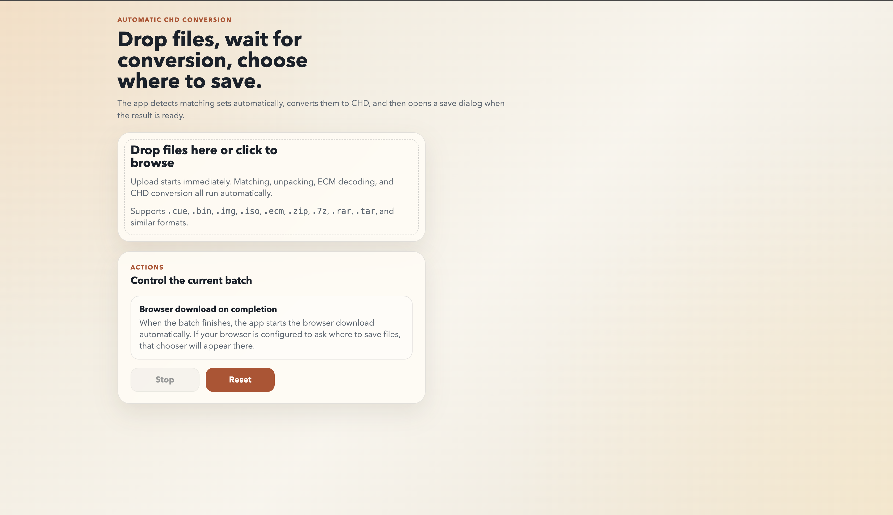
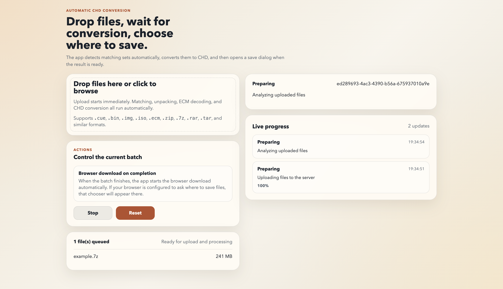

# convertioCHD

`convertioCHD` is a graphical web app that converts common PlayStation and CD image formats into `CHD` files with as little user input as possible.

You open the interface in the browser, drag files into the page, and the app detects how they should be processed:

- matching `BIN` + `CUE` files are grouped automatically
- `BIN.ECM` files are decoded automatically
- archives are unpacked automatically
- completed conversions are downloaded through the browser

The same project works on Windows, macOS, and Linux, and it can be run either directly from the terminal or through Docker Compose.

## Screenshots

<p>
  
</p>

<p>
  
</p>

## Features

- Graphical browser interface with drag and drop
- Automatic detection of related disc files
- Batch conversion of multiple games in one session
- Automatic handling of compressed inputs
- `Stop` and `Reset` controls in the UI
- Live per-job progress and event timeline
- Cross-platform local execution and Docker deployment

## Supported Input Formats

The app can detect and process:

- `*.bin.ecm`
- `*.bin` + `*.cue`
- `*.img`
- `*.iso`
- compressed batches in `zip`, `7z`, `rar`, `tar`, `tgz`, `gz`, `bz2`, and `xz`

If you upload a matching `BIN` and `CUE` pair, they are processed together automatically. If a `CUE` references a `BIN.ECM`, the app resolves that flow without asking the user to do anything manually.

## How The GUI Works

1. Open the web interface in your browser.
2. Drag disc images or archives into the page, or choose them with the file picker.
3. The app analyzes the files, groups matching sets, and starts each conversion job automatically.
4. Progress appears in the right-hand status panel as each job advances.
5. When a conversion finishes, the browser starts the download for the generated `CHD`.

If your browser is configured to ask where downloads should be saved, the usual save dialog will appear there.

## Requirements

### Local run

- Node.js 20 or newer
- A supported browser for the graphical interface

### Docker run

- Docker
- Docker Compose

## Install And Run Locally

The local launcher is designed to be automatic. It installs missing dependencies and starts the web app for you.

```bash
npm start
```

After startup, open:

[http://localhost:5459](http://localhost:5459)

Notes:

- The app listens on port `5459`
- Dependency setup is handled automatically by the project scripts
- On macOS, Homebrew can be used if system packages are needed outside Docker, but the intended flow is still `npm start`

## Run With Docker Compose

Use Docker if you want an isolated environment with the required runtime dependencies already handled by the container build.

```bash
docker compose up --build
```

Then open:

[http://localhost:5459](http://localhost:5459)

To stop the app:

```bash
docker compose down
```

## Testing

Run the automated test suite:

```bash
npm test
```

Run the smoke test with the provided sample files:

```bash
npm run smoke
```

The repository includes test material so you can validate the full conversion flow end to end.

## Project Notes

- Temporary jobs and conversion artifacts are stored under `data/jobs`
- When several games are processed in one session, the app can also generate a ZIP bundle alongside the individual downloads
- ECM decoding is implemented in pure JavaScript to avoid extra native dependencies and keep the project portable across Windows, macOS, and Linux

## Project Structure

- `public/`: browser UI
- `src/`: server and conversion pipeline
- `screenshots/`: README images
- `test-files/`: sample input files for manual and smoke testing
